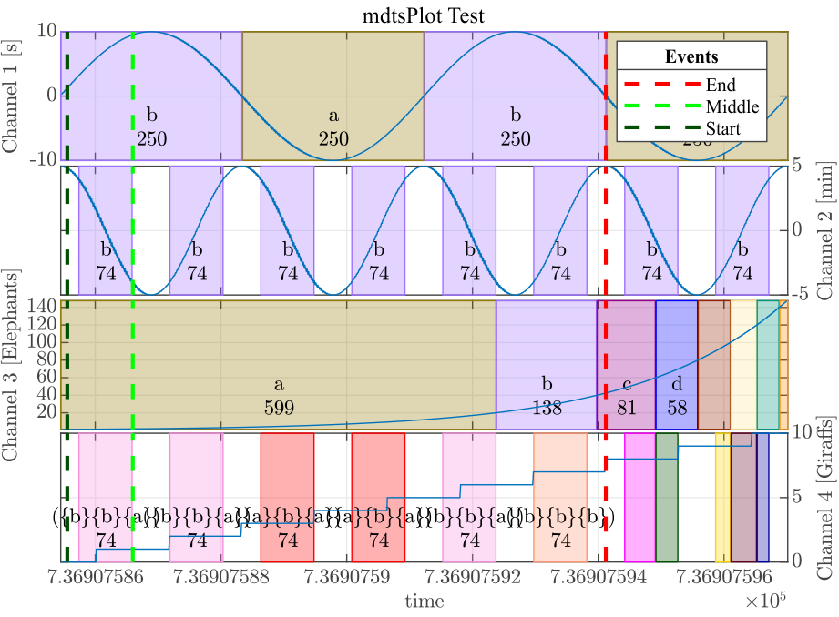

# Multi-dimensional time series toolbox - mdtsTooblox
This toolbox implements classes and methods to handle multi-dimensional time series, i.e, multivariate timeseries.
The goal is to support the data analyst in the handling and manipulation of data. Thus, he can focus on the data itself and does not have to care about data handling.

Additionally this toolbox implements tools and classes for symbolic time series handling.

The documentation of the core component (mdtsObject) can be found in the [Doku](Documentation/mdtsToolboxDocu.pdf).
A short Introduction (How-To) can be found under [HowTo](Documentation/IntroductionToUseMDTSObjects_V1.pdf)

## Dependencies

## License
This project is licensed under the MIT License - see the [license](LICENSE) file for details.

## Example Plot
This plot shows a multi-dimensional time series overlaid with a symbolic time series representation.

